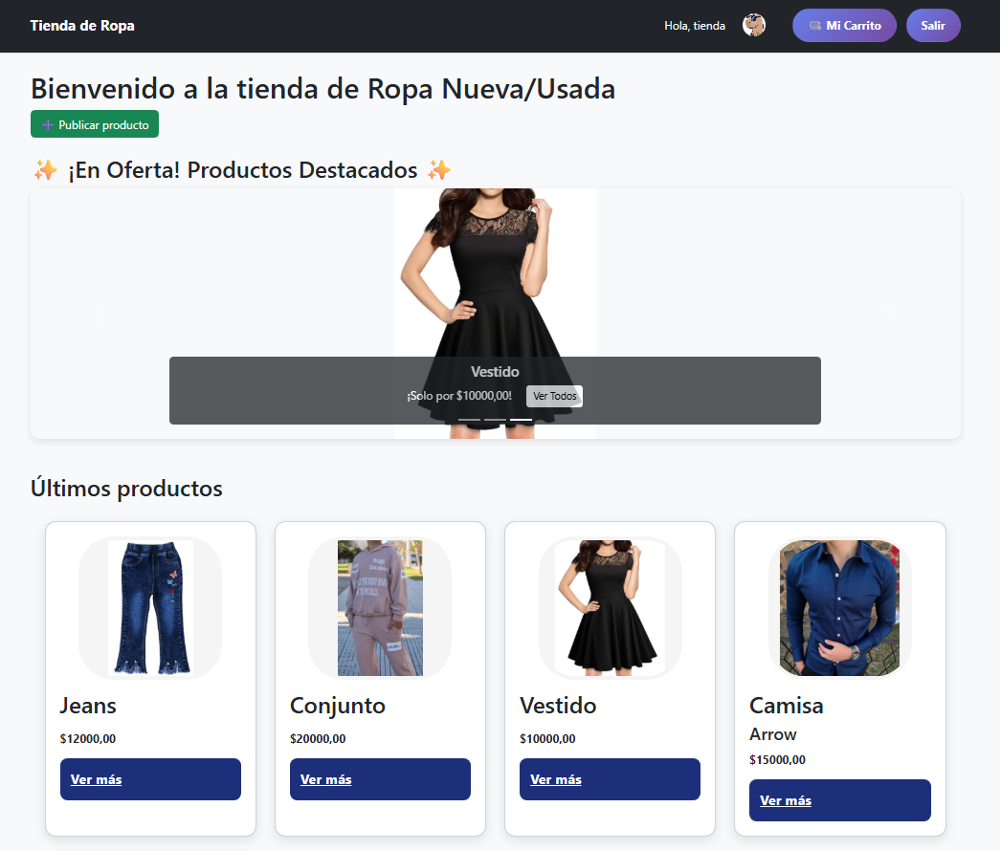
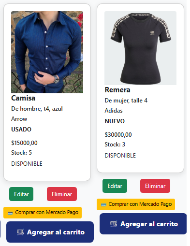
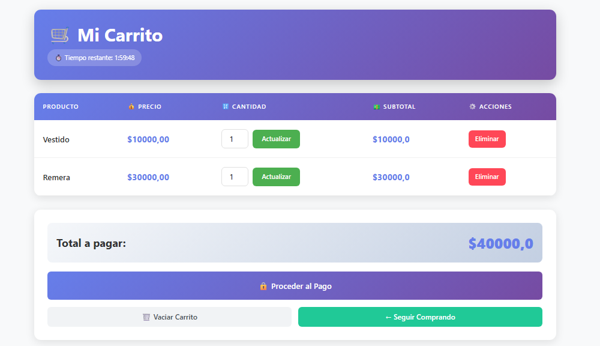
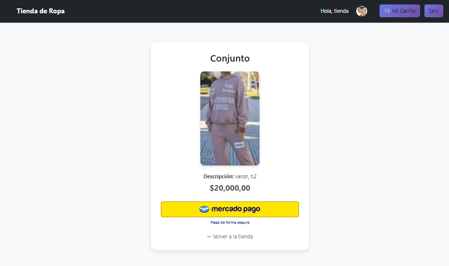
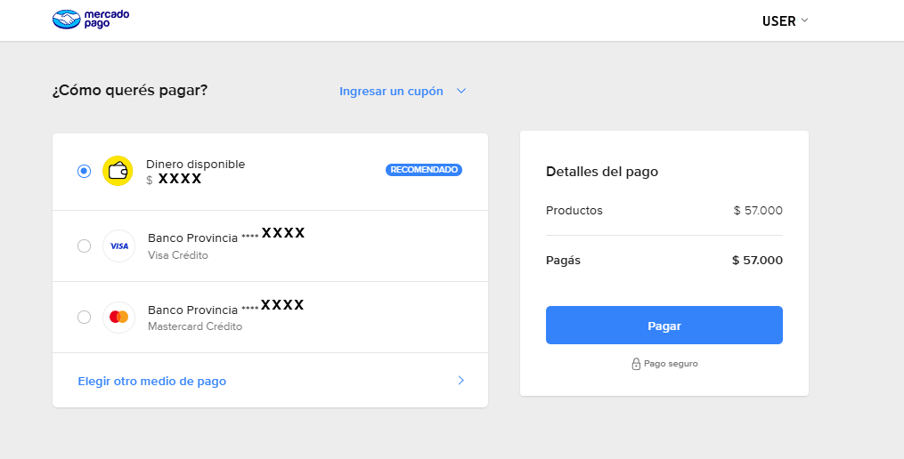

# 🛍️ Tienda de Ropa

Tienda online de ropa nueva y usada con sistema de pagos integrado mediante Mercado Pago.


## 📋 Descripción

Plataforma web desarrollada en Django que permite a los usuarios publicar, comprar y vender ropa nueva o usada de forma segura y sencilla.

## ✨ Funcionalidades Principales

- 👕 **Publicar productos**: Los usuarios pueden listar ropa nueva o usada para vender
- 💳 **Sistema de pagos**: Integración completa con Mercado Pago
- 🔍 **Búsqueda y filtros**: Encuentra fácilmente la prenda que buscas
- 👤 **Perfiles de usuario**: Gestiona tus publicaciones y compras

## 🛠️ Tecnologías Utilizadas

- **Backend**: Python 3.x + Django
- **Base de datos**: SQLite
- **Pagos**: Mercado Pago API
- **Frontend**: HTML, CSS, JavaScript
- **Estilos**: Bootstrap (si aplica)

## 📦 Instalación

### Prerrequisitos

- Python 3.8 o superior
- pip
- Git

### Pasos de instalación

1. **Clona el repositorio**:
```bash
git clone https://github.com/tu-usuario/TiendaRopa.git
cd TiendaRopa
```

2. **Crea un entorno virtual**:
```bash
# Windows
python -m venv .venv
.venv\Scripts\activate

# Linux/Mac
python3 -m venv .venv
source .venv/bin/activate
```

3. **Instala las dependencias**:
```bash
pip install -r requirements.txt
```

4. **Configura las variables de entorno** (crea un archivo `.env`):
```env
SECRET_KEY=tu-clave-secreta-aqui
DEBUG=True
MERCADO_PAGO_ACCESS_TOKEN=tu-token-de-mercado-pago
```

5. **Realiza las migraciones**:
```bash
python manage.py makemigrations
python manage.py migrate
```

6. **Crea un superusuario** (opcional):
```bash
python manage.py createsuperuser
```

7. **Ejecuta el servidor**:
```bash
python manage.py runserver
```

8. **Accede a la aplicación**: 
   - Aplicación: `http://127.0.0.1:8000/`
   - Admin: `http://127.0.0.1:8000/admin/`

## 📸 Capturas de Pantalla

### Pantalla Principal


### Detalle de Producto


### Carrito de Compras


### Proceso de Compra




## 🔧 Configuración de Mercado Pago

1. Crea una cuenta en [Mercado Pago Developers](https://www.mercadopago.com.ar/developers)
2. Obtén tus credenciales (Access Token)
3. Agrégalas al archivo `.env`
4. Configura las URLs de retorno en tu panel de Mercado Pago

## 🚀 Uso

### Para Vendedores
1. Regístrate en la plataforma
2. Completa tu perfil
3. Publica tus prendas con fotos y descripción
4. Establece el precio y condición (nueva/usada)

### Para Compradores
1. Navega por el catálogo
2. Añade productos al carrito
3. Completa el pago con Mercado Pago
4. Recibe confirmación de compra


