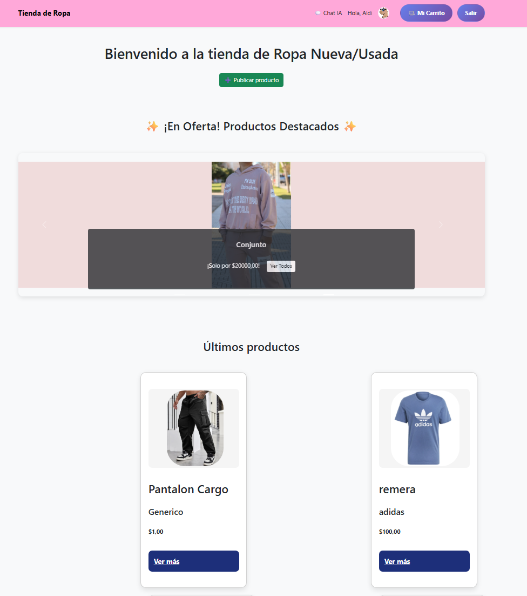
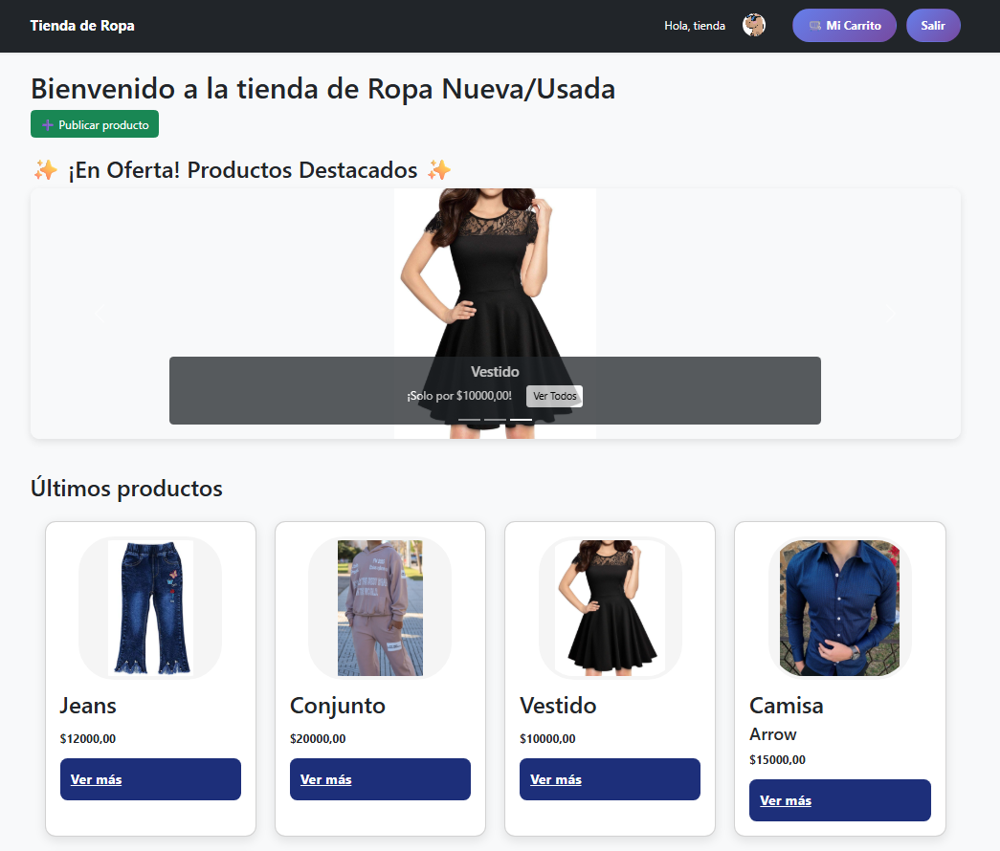
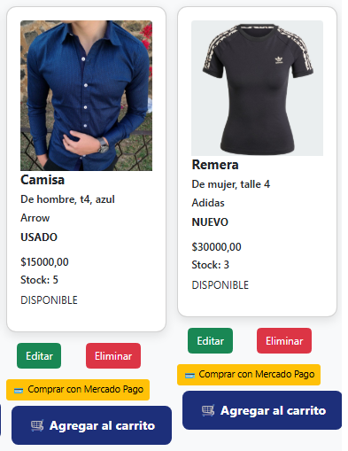
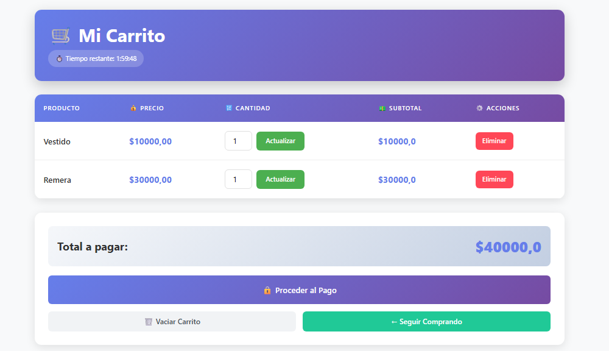
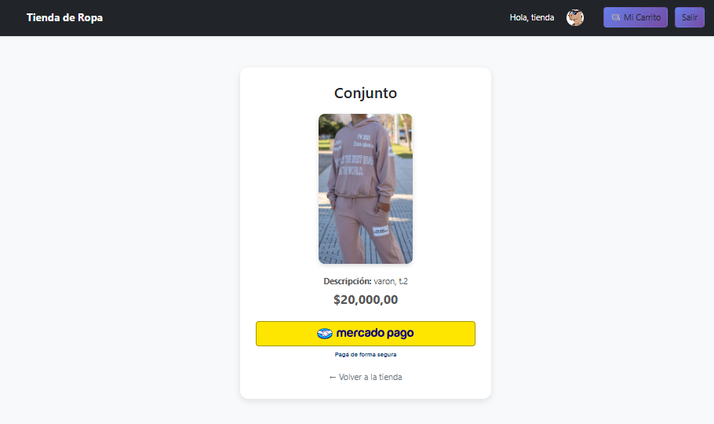
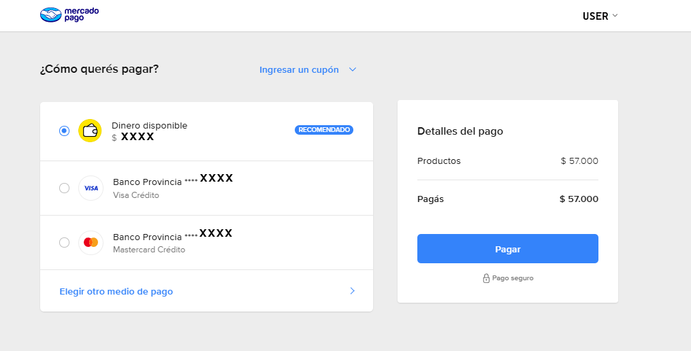

# 🛍️ Tienda de Ropa

Tienda online de ropa nueva y usada con sistema de pagos integrado mediante Mercado Pago, chat con IA, y múltiples funcionalidades de comunicación y gestión.



<p align="center">
  
</p>
## 📋 Descripción

Plataforma web desarrollada en Django que permite a los usuarios publicar, comprar y vender ropa nueva o usada de forma segura y sencilla. Incluye asistente virtual con IA, sistema de presupuestos y compartición en redes sociales.

## ✨ Funcionalidades Principales

- 👕 **Publicar productos**: Los usuarios pueden listar ropa nueva o usada para vender
- 💳 **Sistema de pagos**: Integración completa con Mercado Pago
- 👤 **Perfiles de usuario**: Gestiona tus publicaciones y compras
- 🔍 **Filtros de búsqueda avanzados**: Busca productos por categoría, marca y condición
- 🤖 **Chat con IA**: Asistente virtual inteligente para ayudarte a encontrar productos y resolver dudas
- 📄 **Descarga de presupuestos en PDF**: Genera y descarga presupuestos detallados de tus compras
- 📱 **Compartir en redes sociales**: Comparte productos en Instagram y WhatsApp
- 📲 **Envío a Telegram**: Recibe notificaciones y presupuestos directamente en Telegram

## 🛠️ Tecnologías Utilizadas

- **Backend**: Python 3.x + Django
- **Base de datos**: SQLite
- **Pagos**: Mercado Pago API
- **IA**: Genai API 
- **Mensajería**: Telegram API
- **Frontend**: HTML, CSS, JavaScript
- **Estilos**: Bootstrap

## 📦 Instalación

### Prerrequisitos

- Python 3.8 o superior
- pip
- Git

### Pasos de instalación

1. **Clona el repositorio**:
```bash
git clone https://github.com/tu-usuario/TiendaRopa.git
cd TiendaRopa
```

2. **Crea un entorno virtual**:
```bash
# Windows
python -m venv .venv
.venv\Scripts\activate

# Linux/Mac
python3 -m venv .venv
source .venv/bin/activate
```

3. **Instala las dependencias**:
```bash
pip install -r requirements.txt
```

4. **Configura las variables de entorno** (crea un archivo `.env`):
```env
SECRET_KEY=tu-clave-secreta-aqui
DEBUG=True
MERCADO_PAGO_ACCESS_TOKEN=tu-token-de-mercado-pago
OPENAI_API_KEY=tu-api-key-de-openai
TELEGRAM_BOT_TOKEN=tu-token-de-telegram-bot
TELEGRAM_CHAT_ID=tu-chat-id-de-telegram
```

5. **Realiza las migraciones**:
```bash
python manage.py makemigrations
python manage.py migrate
```

6. **Crea un superusuario** (opcional):
```bash
python manage.py createsuperuser
```

7. **Ejecuta el servidor**:
```bash
python manage.py runserver
```

8. **Accede a la aplicación**: 
   - Aplicación: `http://127.0.0.1:8000/`
   - Admin: `http://127.0.0.1:8000/admin/`

## 📸 Capturas de Pantalla

### Pantalla Principal


### Detalle de Producto


### Carrito de Compras


### Proceso de Compra



### Filtros de Búsqueda


### Chat con IA


### Presupuesto PDF


## 🚀 Uso

### Para Vendedores
1. Regístrate en la plataforma
2. Completa tu perfil
3. Publica tus prendas con fotos y descripción
4. Establece el precio y condición (nueva/usada)
5. Comparte tus productos 

### Para Compradores
1. Navega por el catálogo usando los **filtros de búsqueda**:
   - Categoría (camisetas, pantalones, vestidos, etc.)
   - Condición (nueva/usada)
   - Marca
2. Usa el **chat con IA** para:
   - Encontrar productos específicos
   - Recibir recomendaciones personalizadas
   - Resolver dudas sobre tallas y envíos
3. Añade productos al carrito
4. **Descarga tu presupuesto en PDF** antes de comprar
5. Completa el pago con Mercado Pago


